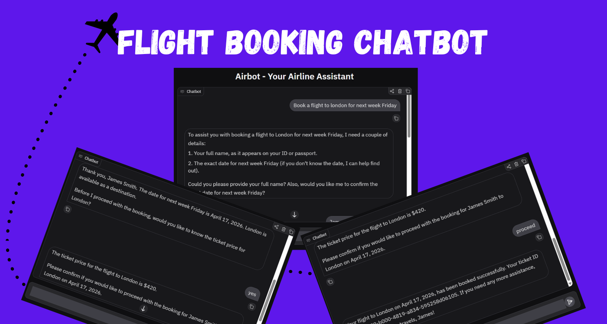

# Airbot - Your Airline Assistant



Airbot is an intelligent chatbot designed to assist customers with airline-related inquiries, flight bookings, cancellations, and general information about flights and services. Built using OpenAI's GPT model, Gradio for the user interface, and SQLite for data storage, Airbot provides a seamless and polite conversational experience.

## Features

- **Flight Booking**: Book flights by providing name, destination, and travel date.
- **Flight Cancellation**: Cancel existing bookings using ticket ID.
- **Flight Status Check**: Verify the status of a booking with ticket ID.
- **Destination Availability**: Check available flight destinations.
- **Pricing Information**: Get ticket prices for specific locations.
- **Date Utilities**: Retrieve today's date for reference.
- **Interactive Chat Interface**: User-friendly Gradio-based web interface.

## Installation

1. **Clone the Repository**:
   ```bash
   git clone <repository-url>
   cd airbot
   ```

2. **Set Up Virtual Environment** (Recommended):
   ```bash
   python -m venv .venv
   # On Windows:
   .venv\Scripts\activate
   # On macOS/Linux:
   source .venv/bin/activate
   ```

3. **Install Dependencies**:
   ```bash
   pip install -r requirements.txt
   ```

4. **Set Up Environment Variables**:
   - Create a `.env` file in the root directory.
   - Add your OpenAI API key:
     ```
     OPENAI_API_KEY=your_openai_api_key_here
     ```

5. **Initialize the Database**:
   The database (`airline_data.db`) is automatically initialized when you run the app. It includes sample ticket prices for various destinations.

## Usage

1. **Run the Application**:
   ```bash
   python app.py
   ```

2. **Access the Chat Interface**:
   - Open the provided URL in your browser (usually `http://127.0.0.1:7860`).
   - Start chatting with Airbot to book flights, check statuses, or ask questions.

3. **Example Interactions**:
   - "I want to book a flight to New York on 2026-05-15."
   - "What's the price for a ticket to Paris?"
   - "Cancel my booking with ticket ID abc123."

## Project Structure

```
airbot/
├── app.py                 # Main Gradio application entry point
├── __init__.py            # Package initialization
├── README.md              # Project documentation
├── .env                   # Environment variables (API keys)
├── .gitignore             # Git ignore file
├── .python-version        # Python version specification
├── airline_data.db        # SQLite database file
├── chatbot/
│   └── engine.py          # Chat engine with OpenAI integration
├── db/
│   └── db_helper.py       # Database helper functions
├── notebook/
│   └── chatbot.ipynb      # Jupyter notebook for experimentation
├── tools/
│   ├── booking_tools.py   # Functions for booking and cancellation
│   ├── description.py     # Tool descriptions and mappings
│   ├── handler.py         # Tool call handler
│   ├── pricing_tools.py   # Pricing and destination tools
│   └── search_tools.py    # Date utility tools
└── utils/                 # Utility functions
```

## Dependencies

- **gradio**: For the web-based chat interface.
- **openai**: For interacting with OpenAI's GPT models.
- **python-dotenv**: For loading environment variables.
- **sqlite3**: Built-in Python module for database operations.

## Contributing

Contributions are welcome! Please follow these steps:

1. Fork the repository.
2. Create a new branch for your feature or bug fix.
3. Make your changes and test thoroughly.
4. Submit a pull request with a clear description of your changes.

## License

This project is licensed under the MIT License. See the LICENSE file for details.

## Support

If you encounter any issues or have questions, please open an issue on the GitHub repository or contact the maintainers.
